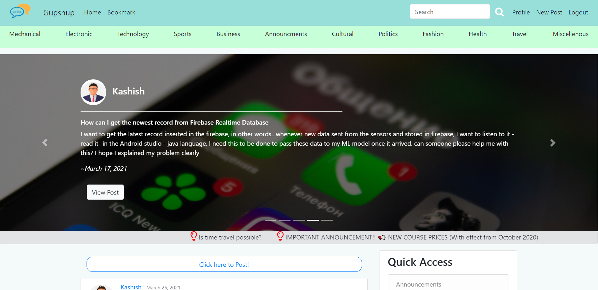
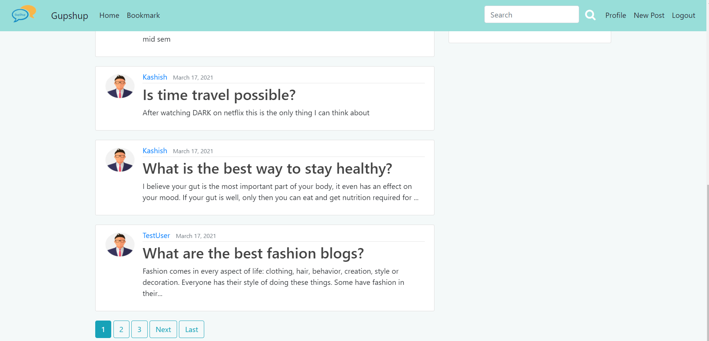
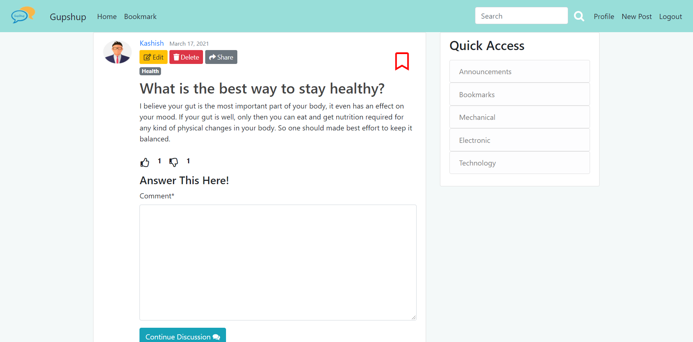
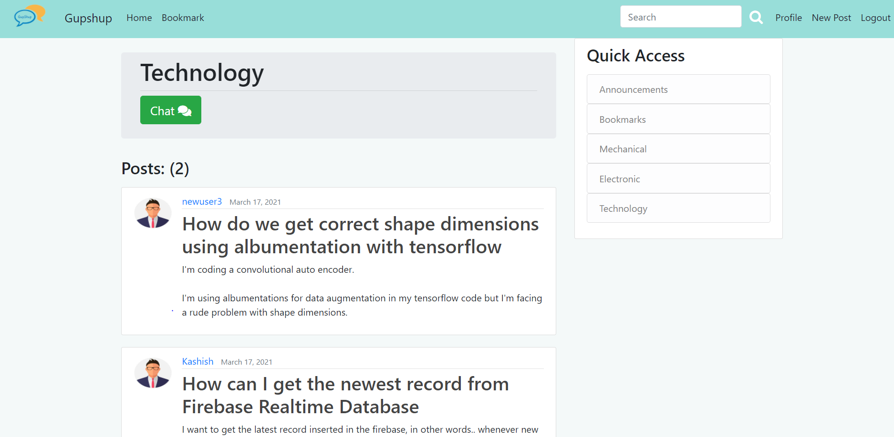
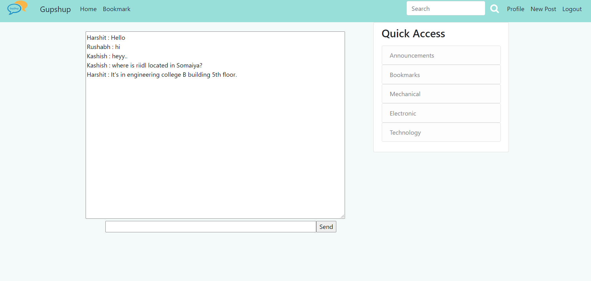

<p align="center">
  
</p>
<br>


<hr>
<h1 align="center">Hi , Welcome to GupShup </h1>


<p align="center">
  <em>
    Generally a college or an institute does not have a place where the students as well as the faculty can come together and can discuss ideas and thoughts. Sometimes the problems can be just solved by mere discussion with someone but the lack of resources, guidance, knowledge and a suitable platform hinders this process of sharing and learning. This website aims to provide a solution for the given problem in an efficient and accurate method.
 
  </em> 

</p>

<br><br>
 

&nbsp;***TECH-STACK***
<p align="left">
  
  <code></code>
  <code>  </code>
  <code>  </code>
  <code>  </code>
  <code>  </code>
  <code>  </code>

  <hr>
  </p>
  
 ---
 
 ### Team Members
 #### 1. Rushabh Gandhi: 1911012
 #### 2. Kashish Harisinghani: 1911016
 #### 3. Harshit Jain: 1911017
 
---
 
 ### Instructions to run
 * Install virtual environment using the following command
 ```
 pip install virtualenv
```
* Create new virtual environment
```
python -m venv <name_of_your_environment>
```
* Activate your virtual environment
```
<name_of_your_environment>\Scripts\activate.bat
```
* Install project dependencies
```
pip install -r requirements.txt
```
* To start a Redis server on port 6379, run the following command (For using real-time chat feature)
```
docker run -p 6379:6379 -d redis:5
```
* Run the server inside project folder and go to the url that appears on your command prompt
```
python manage.py runserver
```
 
---
<h2 align="center">
Snapshots of the project
</h2>
  

  
  
  
  

---


### Features of GupShup
* Login into the web portal using a unique id.
* Adding blogs to the website.
* Question answer-based forum.
* Writing comments for other posts.
* Answering a question.
* Upvote and downvote.
* Segregating the posts based on different categories
* Functionality to bookmark a blog.
* Functionality to share a post.
* Live chat for like-minded people.

---
<h3 align="center"><b>Developed with :heart: by <a href="https://github.com/rushabhgandhi13">Rushabh Gandhi</a>, <a href="https://github.com/kashish1211">Kashish Harisinghani</a>, <a href="https://github.com/HarshitJain28">Harshit Jain</a>.</b></h1>
